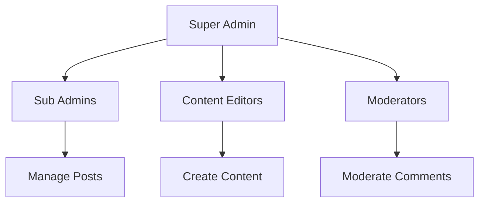

# 📰 Hatharawatin News Portal

<div align="center">


**A Complete News Management System with Admin Panel**

*Built with modern web technologies for seamless news publishing and management*

[🚀 Quick Start](#installation) •
[📖 Documentation](#features) •
[🛠️ Setup](#database-setup) •
[🔐 Admin Panel](#admin-panel) •
[🤝 Contributing](#contributing)

</div>

---

## 📋 Overview

**Hatharawatin News Portal** is a full-featured content management system specifically designed for news websites. It provides a complete solution for publishing, managing, and displaying news articles with a professional admin interface and user-friendly public portal.

### ✨ Key Highlights

- 🌍 **Multilingual Support** - Supports Sinhala (හතර වටින් නිවුස්) and English
- 📱 **Responsive Design** - Works seamlessly across all devices
- 🔒 **Secure Admin Panel** - Role-based access control with multiple admin levels
- 🎨 **Modern UI** - Clean, professional interface with Bootstrap 4
- ⚡ **Performance Optimized** - Fast loading with pagination and optimized queries
- � **Analytics Ready** - View counter and engagement tracking

<div align="center">

## �️ **Navigation Menu**

| 🏠 [Home](#about) | ✨ [Features](#features) | 📸 [Gallery](#demo-screenshots) | 🛠️ [Tech Stack](#technologies-used) |
|:---:|:---:|:---:|:---:|
| **🚀 [Quick Start](#installation)** | **🔐 [Admin Zone](#admin-panel)** | **🤝 [Contribute](#contributing)** | **📄 [License](#license)** |

</div>

---

## 🎯 **About This Project**

<div align="center">

### *🌍 Revolutionizing Digital Journalism*

</div>

**Hatharawatin News Portal** isn't just another news website - it's a **complete digital newsroom ecosystem** that empowers journalists, engages readers, and transforms how news is created, managed, and consumed in the modern world.

<table align="center">
<tr>
<td align="center" width="33%">

### 📰 **For Readers**
🎯 **Discover** trending stories  
🔍 **Search** with precision  
💬 **Engage** through comments  
📱 **Responsive** on any device  

</td>
<td align="center" width="33%">

### ✍️ **For Journalists**
✨ **Create** with rich editor  
📊 **Track** article performance  
🎨 **Upload** stunning visuals  
⚡ **Publish** instantly  

</td>
<td align="center" width="33%">

### 👨‍💼 **For Admins**
🎛️ **Control** everything  
👥 **Manage** team members  
📈 **Analytics** dashboard  
🔐 **Secure** operations  

</td>
</tr>
</table>

> *"In a world of information overload, we bring clarity, accuracy, and engagement to digital news consumption."*


## 🎊 **Feature Showcase**

<div align="center">

### � *What Makes Us Special?*

</div>

<details>
<summary><b>�🌐 Public Portal Experience</b> <i>(Click to explore)</i></summary>

<br>

<table>
<tr>
<td>

#### 🏠 **Dynamic Home Page**
- 📈 **Trending Articles** with real-time updates
- 🎨 **Beautiful Carousels** showcasing featured stories
- 📊 **Category Widgets** for easy navigation
- ⚡ **Fast Loading** optimized performance

</td>
<td>

#### 🔍 **Smart Search & Filter**
- 🎯 **Intelligent Search** with keyword matching
- 📂 **Category Filtering** for precise results
- 📅 **Date Range** filtering options
- 🏷️ **Tag-based** content discovery

</td>
</tr>
<tr>
<td>

#### 📰 **Immersive Article View**
- 📖 **Rich Text Display** with multimedia support
- �️ **Image Galleries** with lightbox effect
- 💬 **Interactive Comments** section
- � **Mobile Optimized** reading experience

</td>
<td>

#### 🌍 **User Engagement**
- � **Comment System** with moderation
- 📧 **Contact Forms** for reader feedback
- ℹ️ **About Pages** with team information
- � **Social Sharing** capabilities

</td>
</tr>
</table>

</details>

<details>
<summary><b>🔐 Admin Control Center</b> <i>(Click to discover power features)</i></summary>

<br>

### � **Analytics Dashboard**
```
📈 Real-time Statistics    📰 Content Performance    👥 User Engagement
   ↓                         ↓                        ↓
📊 Page Views             🎯 Popular Articles      💬 Comment Analytics
📱 Mobile Traffic         📂 Category Insights     📧 Contact Inquiries
🕒 Peak Hours            🔍 Search Trends         📈 Growth Metrics
```

### ✍️ **Content Management Suite**

<table align="center">
<tr>
<th width="50%">📝 **Article Creation**</th>
<th width="50%">🎨 **Media Management**</th>
</tr>
<tr>
<td>

- 🖋️ **Rich WYSIWYG Editor**
- 📄 **Draft & Publish Workflow**
- 🏷️ **Category Assignment**
- 📅 **Scheduling Options**
- 🔄 **Revision History**

</td>
<td>

- 📷 **Image Upload & Optimization**
- �️ **Gallery Management**
- 📁 **File Organization**
- 🎞️ **Media Library**
- ✂️ **Image Editing Tools**

</td>
</tr>
</table>

### 👥 **Team & User Management**



</details>

<details>
<summary><b>🛡️ Security & Performance</b> <i>(Enterprise-grade protection)</i></summary>

<br>

| 🔐 **Security Features** | ⚡ **Performance Optimizations** |
|:---|:---|
| �️ **SQL Injection Protection** | 🚀 **Optimized Database Queries** |
| 🔒 **XSS Prevention** | 💾 **Efficient Caching System** |
| 👤 **Role-Based Access Control** | 📱 **Mobile-First Design** |
| 🔑 **Secure Authentication** | 🖼️ **Image Optimization** |
| 📝 **Input Validation** | ⚡ **Fast Loading Times** |
| 🔄 **Session Management** | 📊 **Performance Monitoring** |

</details>

## 📸 **Visual Gallery**

<div align="center">

### 🎭 *See It In Action*

</div>

<table>
<tr>
<th colspan="3">🌟 <b>Portal Showcase</b></th>
</tr>
<tr>
<td align="center" width="33%">

### 🏠 **Home Page**
*Beautiful, responsive landing*

```
┌─────────────────────┐
│  📰 LATEST NEWS     │
├─────────────────────┤
│ [Feature Article]   │
│ [Trending Stories]  │
│ [Categories Menu]   │
└─────────────────────┘
```
*Click to expand full view*

</td>
<td align="center" width="33%">

### 🎛️ **Admin Dashboard**
*Powerful control center*

```
┌─────────────────────┐
│ 📊 ANALYTICS        │
├─────────────────────┤
│ [Statistics Cards]  │
│ [Charts & Graphs]   │
│ [Quick Actions]     │
└─────────────────────┘
```
*Professional admin interface*

</td>
<td align="center" width="33%">

### ✍️ **Content Editor**
*Rich editing experience*

```
┌─────────────────────┐
│ 📝 WYSIWYG EDITOR   │
├─────────────────────┤
│ [Formatting Tools]  │
│ [Media Upload]      │
│ [Preview Mode]      │
└─────────────────────┘
```
*Intuitive content creation*

</td>
</tr>
</table>

<div align="center">

> 🎬 **Coming Soon:** Interactive demos and video walkthroughs!

[](https://your-demo-link.com)
[](https://your-video-link.com)

</div>

## 🛠️ Technologies Used

### Frontend
- HTML5, CSS3, JavaScript
- Bootstrap 4 - Responsive framework
- jQuery - DOM manipulation
- Owl Carousel - Image sliders
- Animate.css - Smooth animations
- Font Awesome - Icon library

### Backend
- PHP 7.x - Server-side scripting
- MySQL - Database management
- MySQLi - Database driver

### Admin Panel Features
- AdminLTE/Bootstrap Admin Template
- DataTables - Advanced tables
- TinyMCE/Summernote - WYSIWYG editor
- Chart.js - Data visualization
- SweetAlert - Beautiful alerts
- jQuery Validation - Form validation

### Build Tools
- Gulp - Task automation
- BrowserSync - Live reloading
- npm - Package management


## 📥 Installation

### Prerequisites

Before you begin, ensure you have the following installed:
- PHP 7.x or higher
- MySQL 5.6 or higher
- Apache/Nginx web server
- Git

### Step 1: Clone the Repository

```bash
git clone https://github.com/yourusername/hatharawatin-news-portal.git
cd hatharawatin-news-portal
```

### Step 2: Configure Web Server

**For XAMPP:**
```bash
# Move project to htdocs
mv hatharawatin-news-portal C:/xampp/htdocs/
```

**For WAMP:**
```bash
# Move project to www
mv hatharawatin-news-portal C:/wamp/www/
```

**For Linux/Apache:**
```bash
sudo mv hatharawatin-news-portal /var/www/html/
sudo chown -R www-data:www-data /var/www/html/hatharawatin-news-portal
```

### Step 3: Install Dependencies (Optional)

For development with Gulp:

```bash
npm install
gulp
```


## 🗄️ Database Setup

### Step 1: Create Database

Open phpMyAdmin or MySQL command line and create a new database:

```sql
CREATE DATABASE newsportal;
```

### Step 2: Import Database Schema

Import the provided SQL file (if available) or create the required tables manually.

**Using phpMyAdmin:**
1. Navigate to `http://localhost/phpmyadmin`
2. Select the `newsportal` database
3. Click on "Import" tab
4. Choose the SQL file and click "Go"

**Using MySQL Command Line:**
```bash
mysql -u root -p newsportal < database.sql
```

### Step 3: Create Admin Account

If no SQL file is provided, create a default admin account:

```sql
USE newsportal;

CREATE TABLE IF NOT EXISTS tbladmin (
    id INT(11) AUTO_INCREMENT PRIMARY KEY,
    AdminUserName VARCHAR(255) NOT NULL,
    AdminEmailId VARCHAR(255) NOT NULL,
    AdminPassword VARCHAR(255) NOT NULL,
    userType INT(11) DEFAULT 0,
    CreationDate TIMESTAMP DEFAULT CURRENT_TIMESTAMP,
    UpdationDate TIMESTAMP NULL ON UPDATE CURRENT_TIMESTAMP
);

INSERT INTO tbladmin (AdminUserName, AdminEmailId, AdminPassword, userType) 
VALUES ('admin', 'admin@newsportal.com', MD5('Test@123'), 1);
```

**Default Admin Credentials:**
- Username: `admin`
- Password: `Test@123`

> ⚠️ **Important:** Change the default password immediately after first login!


## ⚙️ Configuration

### Database Configuration

Update the database configuration in both locations:

**1. Public Site Config:** `includes/config.php`

```php
<?php
define('DB_SERVER','localhost');
define('DB_USER','root');           // Your MySQL username
define('DB_PASS','');               // Your MySQL password
define('DB_NAME','newsportal');     // Database name
$con = mysqli_connect(DB_SERVER,DB_USER,DB_PASS,DB_NAME);

// Check connection
if (mysqli_connect_errno()) {
    echo "Failed to connect to MySQL: " . mysqli_connect_error();
}
?>
```

**2. Admin Panel Config:** `admin/includes/config.php`

```php
<?php
define('DB_SERVER','localhost');
define('DB_USER','root');
define('DB_PASS','');
define('DB_NAME','newsportal');
$con = mysqli_connect(DB_SERVER,DB_USER,DB_PASS,DB_NAME);
?>
```

### File Permissions

Set proper permissions for upload directories:

```bash
chmod 755 admin/postimages/
chmod 755 images/
```

## 🚀 Usage

### Accessing the Application

**Public Portal:**
```
http://localhost/hatharawatin-news-portal/
```

**Admin Panel:**
```
http://localhost/hatharawatin-news-portal/admin/
```

### Admin Panel Features

1. **Login** - Use default credentials to access admin panel
2. **Dashboard** - View site statistics and recent activity
3. **Create Posts** - Navigate to Posts → Add Post
4. **Manage Categories** - Organize content with categories
5. **Moderate Comments** - Approve or delete user comments
6. **Manage Users** - Add sub-admins with different permissions


### Quick Start Guide

#### Creating Your First News Post

1. Login to admin panel
2. Navigate to **Posts** → **Add Post**
3. Fill in the form:
   - Post Title
   - Category and Subcategory
   - Post Details (use the rich text editor)
   - Upload a featured image
4. Click **Submit**
5. View your post on the home page

#### Managing Categories

1. Go to **Categories** → **Add Category**
2. Enter category name and optional description
3. Create subcategories under main categories
4. Assign posts to categories for better organization

## � Project Structure

```
hatharawatin-news-portal/
│
├── admin/                      # Admin Panel
│   ├── assets/                # Admin CSS, JS, images
│   ├── includes/              # Admin config files
│   ├── postimages/            # Uploaded post images
│   ├── dashboard.php          # Admin dashboard
│   ├── add-post.php           # Add new post
│   ├── manage-posts.php       # Manage posts
│   ├── add-category.php       # Add categories
│   └── ...                    # Other admin pages
│
├── css/                       # Public stylesheets
├── js/                        # JavaScript files
├── images/                    # Public images
├── includes/                  # Public site includes
│   ├── config.php            # Database config
│   ├── header.php            # Site header
│   ├── footer.php            # Site footer
│   └── sidebar.php           # Sidebar widgets
│
├── plugins/                   # jQuery plugins
├── vendor/                    # Third-party libraries
│
├── index.php                 # Home page
├── category.php              # Category listing
├── news-details.php          # Article details
├── search.php                # Search results
├── about-us.php              # About page
├── contact-us.php            # Contact page
└── gulpfile.js               # Gulp tasks
```

## 🔐 Admin Panel

### Access Credentials

**URL:** `/admin/`

**Default Login:**
- 👤 Username: `admin`
- 🔑 Password: `Test@123`

### Available Features

| Feature | Description |
|---------|-------------|
| 📊 Dashboard | Overview statistics and analytics |
| ✍️ Add Post | Create new news articles |
| 📝 Manage Posts | Edit, delete, or trash posts |
| 📂 Categories | Create and organize categories |
| 💬 Comments | Moderate user comments |
| 👥 Sub-admins | Manage admin users |
| ⚙️ Settings | Update site information |

## 🔒 Security

### Security Features Implemented

- ✅ Session-based authentication
- ✅ Password hashing (MD5)
- ✅ SQL injection protection (mysqli)
- ✅ XSS prevention (htmlentities)
- ✅ File upload validation
- ✅ Role-based access control

### Security Recommendations

> ⚠️ **Important Security Notes:**

1. **Update Default Credentials** - Change admin password after installation
2. **Use Prepared Statements** - Migrate from direct queries to prepared statements
3. **Upgrade Password Hashing** - Replace MD5 with `password_hash()` and `password_verify()`
4. **Enable HTTPS** - Use SSL certificate in production
5. **Regular Updates** - Keep PHP, MySQL, and libraries updated
6. **Backup Regularly** - Implement automated backup solutions
7. **Input Validation** - Validate and sanitize all user inputs
8. **Limit File Uploads** - Restrict file types and sizes

## 🗄️ Database Schema

### Core Tables

```sql
tbladmin          -- Admin users and credentials
tblcategory       -- News categories
tblsubcategory    -- Subcategories for news
tblposts          -- News articles/posts
tblcomments       -- User comments on posts
tblpages          -- Static pages (About, Contact)
```


## 🤝 Contributing

Contributions are welcome! Here's how you can help:

### How to Contribute

1. **Fork the Repository**
   ```bash
   git clone https://github.com/yourusername/hatharawatin-news-portal.git
   ```

2. **Create a Feature Branch**
   ```bash
   git checkout -b feature/AmazingFeature
   ```

3. **Commit Your Changes**
   ```bash
   git commit -m 'Add some AmazingFeature'
   ```

4. **Push to Branch**
   ```bash
   git push origin feature/AmazingFeature
   ```

5. **Open a Pull Request**

### Contribution Guidelines

- Write clear, descriptive commit messages
- Follow existing code style and conventions
- Test your changes thoroughly
- Update documentation as needed
- Add comments for complex logic

## 🐛 Bug Reports

If you find a bug, please create an issue with:
- Clear description of the problem
- Steps to reproduce
- Expected vs actual behavior
- Screenshots (if applicable)
- System information (PHP version, MySQL version, etc.)

## 💡 Feature Requests

Have an idea? Create an issue with:
- Detailed description of the feature
- Use case and benefits
- Possible implementation approach

## 📝 Roadmap & Future Enhancements

### Planned Features

- [ ] **Security Improvements**
  - [ ] Implement prepared statements
  - [ ] Upgrade to bcrypt/Argon2 password hashing
  - [ ] Add CSRF protection
  - [ ] Implement rate limiting

- [ ] **User Features**
  - [ ] User registration and authentication
  - [ ] User profiles and avatars
  - [ ] Bookmark/favorite articles
  - [ ] Newsletter subscription

- [ ] **Content Features**
  - [ ] Social media sharing buttons
  - [ ] Related posts suggestions
  - [ ] Tags and tag cloud
  - [ ] Advanced search filters
  - [ ] Multi-language support

- [ ] **Technical Improvements**
  - [ ] RESTful API for mobile apps
  - [ ] Real-time notifications
  - [ ] SEO optimization
  - [ ] Caching implementation
  - [ ] Image optimization
  - [ ] PWA support

- [ ] **Admin Enhancements**
  - [ ] Advanced analytics dashboard
  - [ ] Bulk operations
  - [ ] Content scheduling
  - [ ] Revision history
  - [ ] Export functionality

## 📄 License

This project is licensed under the MIT License - see the [LICENSE](LICENSE) file for details.

```
MIT License

Copyright (c) 2025 Hatharawatin News Portal

Permission is hereby granted, free of charge, to any person obtaining a copy
of this software and associated documentation files (the "Software"), to deal
in the Software without restriction, including without limitation the rights
to use, copy, modify, merge, publish, distribute, sublicense, and/or sell
copies of the Software, and to permit persons to whom the Software is
furnished to do so, subject to the following conditions:

The above copyright notice and this permission notice shall be included in all
copies or substantial portions of the Software.

THE SOFTWARE IS PROVIDED "AS IS", WITHOUT WARRANTY OF ANY KIND, EXPRESS OR
IMPLIED, INCLUDING BUT NOT LIMITED TO THE WARRANTIES OF MERCHANTABILITY,
FITNESS FOR A PARTICULAR PURPOSE AND NONINFRINGEMENT.
```

## 👥 Authors & Contributors

- **Original Author** - Initial work

See the list of [contributors](https://github.com/yourusername/hatharawatin-news-portal/contributors) who participated in this project.

## 🙏 Acknowledgments

- Bootstrap team for the amazing framework
- jQuery community
- All open-source contributors
- Icons by Font Awesome

## 📞 Support & Contact

- **Issues:** [GitHub Issues](https://github.com/yourusername/hatharawatin-news-portal/issues)
- **Discussions:** [GitHub Discussions](https://github.com/yourusername/hatharawatin-news-portal/discussions)
- **Email:** support@hatharawatin.com

## 📊 Project Stats


---

<div align="center">

### ⭐ Star this repository if you find it helpful!

**Made with ❤️ for the community**

[Report Bug](https://github.com/yourusername/hatharawatin-news-portal/issues) · [Request Feature](https://github.com/yourusername/hatharawatin-news-portal/issues) · [Documentation](https://github.com/yourusername/hatharawatin-news-portal/wiki)

</div>
